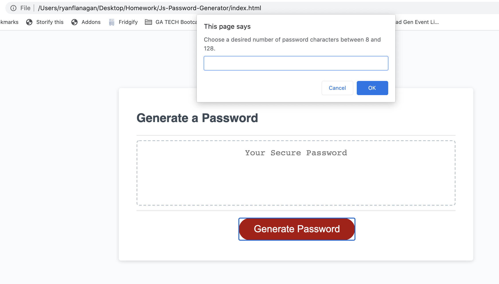
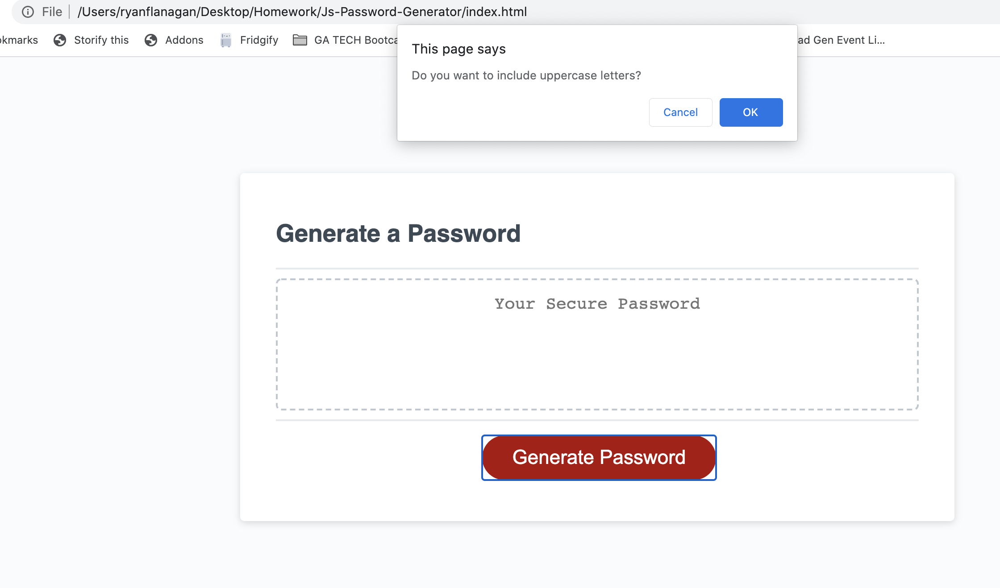
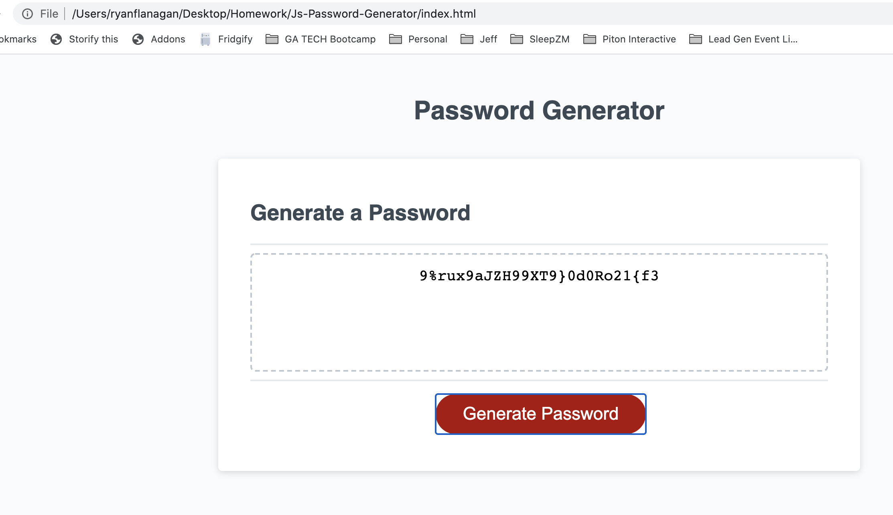

# Js-Password-Generator

## Description
To create an application that generates a random password based on user-selected criteria.

This site contains 4 pages in addition to this ReadMe file.

- [Index](https://rflanagan82.github.io/Js-Password-Generator/)
- [Style.css](https://github.com/RFlanagan82/Js-Password-Generator/blob/master/style.css)
- [Script.js](https://github.com/RFlanagan82/Js-Password-Generator/blob/master/script.js)

## Accepted Criteria

The accepted criteria is found here:

- [Instructions.md](https://github.com/RFlanagan82/Js-Password-Generator/blob/master/instructions.md)

## Usage

All of the files necesary to run this website are available in [this repository](https://github.com/RFlanagan82/Js-Password-Generator).

## Link to Deployed Application
[Click here to access the Password Generator](https://rflanagan82.github.io/Js-Password-Generator/)

## Outstanding Issues

Initially I struggled with my array values because I didn't define each item within as a string in quotations. Working with Christina Starr helped me remember that these elements needed to be in quotes.

Secondly, I was able to easily figure out how to keep the variable 'passwordLength' between 8 and 128, along with preventing a null entry, but struggled a bit with entries that weren't numbers. 

When I came to my conditionals, I used 'if' then 'else statements and just made the following confirm question as the else. I soon realized that this did not work because the confirm question needed to happen on the 'if' outcome as well.

I dropped the 'else' statements and only made my conditionals 'if' statements upon this realization.

Lastly, I struggled a bit with my for loop. 

I knew that I needed it to loop for as long as the passwordLength variable was coded for via the user's input, but I had a bit of trouble formatting the loop's function properly. 

I also knew that the function needed a Math.random and Math.floor property for my mergedValues variable but unsure how to account for the mergedValues length or where the result should be mapped to.

Eventually I was able to get each of the prompts to work.

1. 

2. 

3. 

## Contributions / Credits

On 9-3-2020, I worked with Christina Starr who helped me improve my array structures for the possible characters to be used. Reference lines 15-18.

My tutor, Ariel Razon, also helped me understand a few specific points needed in order for the functions to work.

This included: NaN 'Not a Number' property for line 35 and helping me identify how to apply falsy values ex:'!var' for line 74.

Ariel Razon also helped me better format my loop on line 84 to create a function that randomizes and joins together the elements within the users' selected arrays - and returns as a string.

## Resources

-[NaN](https://developer.mozilla.org/en-US/docs/Web/JavaScript/Reference/Global_Objects/isNaN)
-[Definition of Falsy](https://developer.mozilla.org/en-US/docs/Glossary/Falsy)
-[String Concat() Method](https://www.techonthenet.com/js/string_concat.php)

## License
MIT License

Copyright (c) [2020] [Ryan Flanagan]

Permission is hereby granted, free of charge, to any person obtaining a copy of this software and associated documentation files (the "Software"), to deal in the Software without restriction, including without limitation the rights to use, copy, modify, merge, publish, distribute, sublicense, and/or sell copies of the Software, and to permit persons to whom the Software is furnished to do so, subject to the following conditions:

The above copyright notice and this permission notice shall be included in all copies or substantial portions of the Software.

THE SOFTWARE IS PROVIDED "AS IS", WITHOUT WARRANTY OF ANY KIND, EXPRESS OR IMPLIED, INCLUDING BUT NOT LIMITED TO THE WARRANTIES OF MERCHANTABILITY, FITNESS FOR A PARTICULAR PURPOSE AND NONINFRINGEMENT. IN NO EVENT SHALL THE AUTHORS OR COPYRIGHT HOLDERS BE LIABLE FOR ANY CLAIM, DAMAGES OR OTHER LIABILITY, WHETHER IN AN ACTION OF CONTRACT, TORT OR OTHERWISE, ARISING FROM, OUT OF OR IN CONNECTION WITH THE SOFTWARE OR THE USE OR OTHER DEALINGS IN THE SOFTWARE.
